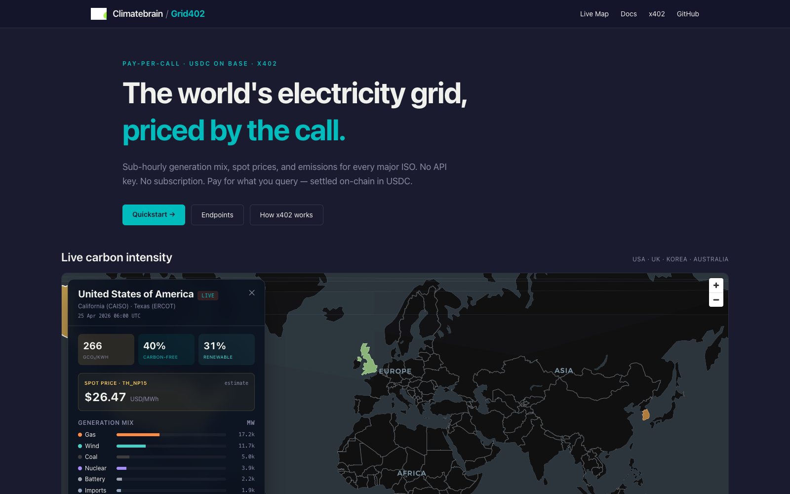
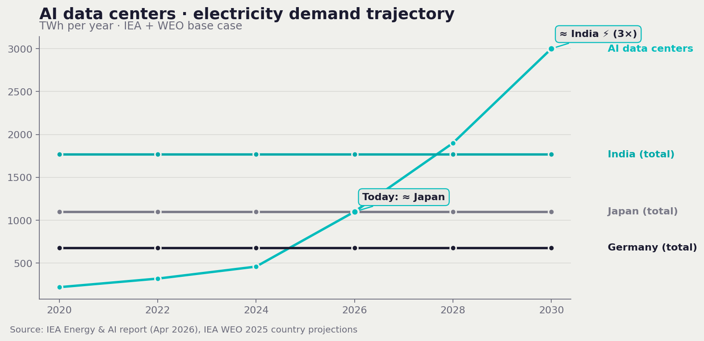
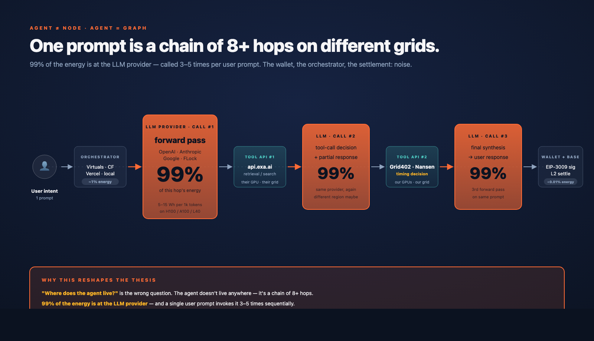
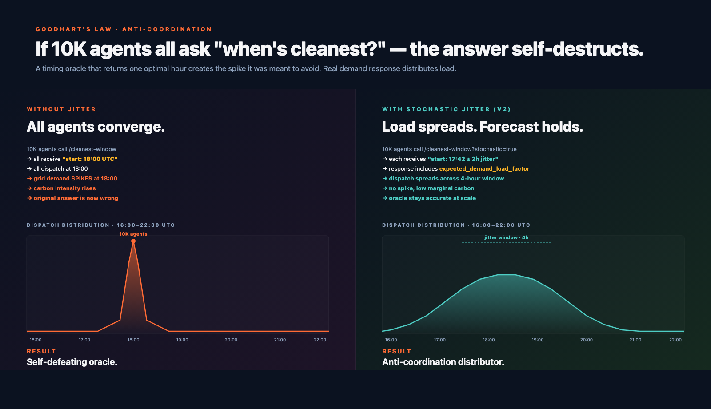

<div align="center">

# Grid402

**The world's electricity grid, priced by the call.**

Per-call grid receipts (5-min mix + carbon intensity + spot price) for autonomous compute — **programmable demand response**, settled on-chain in USDC on Base via the [x402](https://x402.org) protocol. Time your agents. Route your GPU workloads.

[**Live demo →**](https://grid402.climatebrain.xyz) &nbsp;·&nbsp; [Use cases](https://grid402.climatebrain.xyz/use-cases) &nbsp;·&nbsp; [Docs](https://grid402.climatebrain.xyz/docs) &nbsp;·&nbsp; [Skills](./skills.md) &nbsp;·&nbsp; [How x402 works](https://grid402.climatebrain.xyz/docs/x402) &nbsp;·&nbsp; [Endpoints](https://grid402.climatebrain.xyz/docs/endpoints)



</div>

---

## What this is

Grid402 is a **data primitive for AI agents**. It exposes the world's electricity grid — generation mix, carbon intensity, spot prices — as plain HTTP, metered per request, settled in USDC on Base. No keys, no dashboards, no annual contracts. The HTTP request *is* the on-chain payment.

### What we sell

|   | Product | Why it's at this tier |
|---|---|---|
| **Primary** | **5-minute generation mix + carbon intensity** | The moat. The signal that makes 24/7 CFE verification, hourly CBAM reporting, and DePIN slashing computationally possible. **Electricity Maps gates this at €6,000/year per signal**; we sell it at ~$0.005/call. |
| **Derived** | Self-computed gCO₂/kWh | Mix × IPCC AR6 lifecycle factors. Audit-traceable: every response cites the factor source. We never redistribute vendor numbers. |
| **Bundled** | Spot price (LMP / SMP / RRP) | Already a commodity — public ISO feeds, GridStatus, dozens of vendors. We ship it so agents have one HTTP call for both arbitrage signals. |
| **Combined** | All three in one request | Recommended for agents. One HTTP round-trip → one USDC tx → mix + emissions + price. |

The live demo above is also a working **open-source clone of [Electricity Maps](https://app.electricitymaps.com)**, dark-themed with the [ClimateBrain](https://climatebrain.xyz) brand. Same visual language as the gold-standard reference, with sub-national choropleth, time slider, and click-to-drill sidebar — all served from a single Cloudflare Pages deploy.

## The stake — AI is now a country-scale grid load

> **AI data centers used 1,100 TWh of electricity in 2026 — as much as Japan.** By 2030, IEA forecasts triple that (≈ India). The fastest-growing slice is autonomous agents: hundreds of paid calls per human prompt, every call a workload on someone's grid.



The honest physics, in three lines:

- **99% of an agent call's energy is GPU LLM inference.** HTTP I/O, payment signatures, and orchestration overhead combined are <1% — statistical noise. The forward pass on a physical GPU is the only meaningful load.
- **Same workload, up to 20× carbon swing.** Llama 3 70B inference on Quebec hydro ≈ 30 gCO₂; same prompt on a Texas summer afternoon gas peaker ≈ 600 gCO₂. Same answer, twenty-fold delta. The lever is **location** and **timing**.
- **Agents are blind to all of this.** The stack hides energy at every layer (Docker → K8s → EC2 → physical GPU → datacenter PUE 1.1–1.6 → regional grid → ISO fuel mix). Cloud providers publish annual regional averages — never real-time per-workload draw. Grid402 is the missing observation surface.

This is the lever — but **only schedulable workloads can pull it**. Single chat-agent calls (0.001–0.01 g CO₂) sit below the noise floor; **ML training jobs (12–72h, MWh-class), DePIN GPU operators, batch inference, crypto mining, and EV charging** are where this product is *economically* meaningful. See [`PRD.md`](_internal/docs/PRD.md) §3 for the green/yellow customer hierarchy.

## Why this exists

> Clean-energy accounting just shifted from once-a-year paperwork to **hour-by-hour receipts**.

Three regulations are converging worldwide and all of them require **hourly matching**:

| Regulation | Region | Hourly matching by | What it forces |
|---|---|---|---|
| **CBAM** | EU | 2026 (now) | Importers of electricity, steel, aluminum, fertilizer must declare hourly emissions |
| **IRA 45V** | US | 2030 | Clean-hydrogen producers must match power hourly to claim the tax credit |
| **EU RFNBO** | EU | 2030 | Renewable hydrogen / e-fuels must be matched hourly |

That shift turns the grid into a **real-time programming problem** for every company producing hydrogen, importing steel, running data centers, or claiming 24/7 clean energy.

Today, the data sits behind:
- **Enterprise vendors** (Platts, Enverus, Kpler) — five-figure annual contracts, sales calls, RFPs, custom feeds.
- **Electricity Maps** — €6,000/year *per signal*, no redistribution, AGPL-3.0 parsers.
- **Raw ISO/RTO feeds** — 12 governments, 12 schemas, 12 auth flows. Free but unusable as a single primitive.

None of them sell to **software**. Grid402 does — by the call, on-chain, in seconds.

## The crown jewel: sub-hourly mix

Most vendors ship **hourly** generation mix. The whole reason hourly matching is a hard regulation is that it doesn't match human procurement timelines anymore. The signal that makes 24/7 CFE verification, hourly CBAM reports, and DePIN slashing decisions actually computable is **5-minute generation mix per ISO region** — direct from each grid operator's public dispatch feed.

That's what Grid402 ships. **Same technical signal Electricity Maps gates at €6,000/year, sold at $0.005/call**, because the upstream (CAISO, ERCOT, NESO, KPX, AEMO) is already public at that granularity. The market inefficiency was never the data — it was the billing shape.

## The dual role of agents

AI agents are not just data **consumers** — they're physical **grid loads** themselves. Every LLM inference (~1 Wh per 200 tokens), every HTTP I/O (~0.05 Wh), every wallet signature, every smart-contract execution runs on a GPU somewhere on a real grid. So Grid402 serves two functions for the same agent:

1. **Data consumer** — agent calls Grid402 for energy prices/emissions to make decisions about external workloads (workload scheduling, DePIN reward routing, prediction-market resolution).
2. **Self-knowledge layer** *(v2)* — agent calls Grid402 to know *its own* grid carbon footprint per session (`/whereami`, `/footprint/session`, `/route/cleanest`).

This is the only API that lets autonomous software introspect its own environmental cost in real time.

### What an "agent" actually is — a graph, not a single thing

When you look at the [x402 Bazaar](https://www.x402scan.com) you see thousands of buyer wallets calling dozens of paid servers. But each "agent" behind a wallet is **not a single piece of compute** — it's a graph that spans multiple operators:

```
[user intent]
  → [orchestrator]        e.g. Virtuals, Cloudflare Agents, OpenAI Assistants, local K8s
  → [LLM provider]        e.g. OpenAI, Anthropic, FLock — 99% of the energy bill
  → [tool API #1]         e.g. api.exa.ai (search/embedding)
  → [LLM provider]        another inference pass to interpret the result
  → [tool API #2]         e.g. Grid402, Nansen, public.zapper.xyz
  → [LLM provider]        final synthesis
  → [wallet sign + facilitator + Base settlement]
```

A single user prompt typically triggers **3–5 LLM forward passes + 2–4 tool calls**, each on its own substrate, on its own grid. "Where the agent lives" is the wrong question — the right question is "what is the agent's *carbon graph*?"



### The two-sided ecosystem (supply + demand)

The x402 ecosystem has **two energy-consuming sides**, both visible in the Bazaar metrics:

| Side | What it is | Examples (live in Bazaar) | Energy character |
|---|---|---|---|
| **Supply (servers)** | Endpoints listed in `Top Servers` that *receive* x402 payments | `api.exa.ai`, `hub.atxp.ai`, `mcp-x402.vishwanetwork.xyz`, `acp-x402.virtuals.io`, … | Hosting region's grid × per-request compute (varies wildly: search/embedding is heavy, financial data is cheap) |
| **Demand (agents)** | Buyer wallets calling those servers | The 8K+ unique buyer addresses behind the same Top Servers list | LLM provider's grid × inference compute (dominates by ~100×); tiny orchestration overhead from where the agent's loop runs |

Grid402 is **on both sides**: we're a *supply-side* server (we receive x402 payments at a known wallet, our hosting region has its own carbon profile), and our customers are *demand-side* agents (whose decisions about *when* to dispatch their own workloads are the entire reason we exist).

### Where the energy actually lives — four customer tiers

The energy bill in this ecosystem isn't evenly distributed. **~99% of it lives at the LLM provider tier**, even though that tier is invisible in the Bazaar leaderboard:

| Tier | Who | Visibility in Bazaar | Energy share | Decision power over compute placement |
|---|---|---|---|---|
| **1. LLM providers** | OpenAI, Anthropic, Google, FLock, Mistral | invisible (they're called by every server *and* every agent) | ~99% | Provider chooses datacenter region; in FLock's case, chooses operator from a $FLOCK-staked network |
| **2. Agent platforms** | Virtuals, Cloudflare Agents, Vercel AI SDK, OpenAI Assistants, Claude with computer use | partially visible (`acp-x402.virtuals.io` shows up) | small (orchestration only) | Platform decides which region the orchestration runs in; they aggregate thousands of agents |
| **3. Tool / API operators** | Every server in the Bazaar's Top Servers list | fully visible | small per-server, but each one runs *its own* compute on its *own* grid | Operator picks deployment region (Vercel global, CF Workers, AWS, self-host) |
| **4. Individual agent wallets** | The 8K+ buyer addresses behind those servers | only the wallet address visible | negligible per agent (just orchestration + signing); aggregate matters at scale | Wallet's owner picks the orchestration substrate (laptop, K8s, Virtuals, …) |

What shifts when:
- Tier 1 shifts when LLM providers themselves route to greener operators.
- Tier 2 shifts when platforms embed timing logic into their SDKs (one integration scales to all hosted agents).
- Tier 3 shifts when individual API operators pick deployment regions with carbon awareness.
- Tier 4 shifts when individual agents call our timing endpoints before dispatching their own work.

Each tier has its own optimization lever and maps to a different Grid402 endpoint shape.


### One more wrinkle — anti-coordination at scale

If 10,000 agents all call `/cleanest-window` and get the same answer ("18:00 UTC is the greenest"), they all dispatch at 18:00 UTC and create a demand spike that turns 18:00 UTC into the *dirtiest* hour. Goodhart's law for grid optimization.

The honest version of the timing oracle includes **stochastic distribution across the recommended window** (`?jitter=2h`) and **load-factor awareness** in the response (`expected_demand_load_factor: 0.73`). At small scale this is invisible; at the scale x402 is heading, the timing oracle is also a **coordination dampener**.



## Grid402 is one skill of six — the agent skill set

An agent that does programmable demand response autonomously needs more than one API. Grid402 ships the timing/grid skill; five other skills exist already in adjacent infrastructure on or near Base. The full set:

| # | Skill | Provider | What the agent gets |
|---|---|---|---|
| 1 | Grid receipts (timing and routing) | **Grid402** | per-call mix, emissions, spot for any supported ISO region |
| 2 | Wallet and payment | **Coinbase CDP Server Wallet** | EIP-3009 signing, USDC custody, gasless transfers |
| 3 | Reasoning | **FLock** (or any OpenAI-compatible LLM) | LLM inference per token |
| 4 | Self-observation | **Nansen** | own wallet history, peer labels, payee traction |
| 5 | Context (web and social) | **Selanet** | scrape Twitter / Xiaohongshu / YouTube / LinkedIn / free-form URLs |
| 6 | Discovery | **Coinbase AgentKit + x402 Bazaar** | `discover_x402_services` to auto-find paid endpoints by keyword |

An agent wired with all six is fully autonomous: it decides when and where to run, pays for its own data, reasons about results, observes its own treasury, gathers unstructured context, and discovers new skills as the ecosystem grows.

Grid402's product position: **one skill of six, plus curation of the catalog**. The shareable catalog with install patterns and per-skill call examples lives at [`skills.md`](./skills.md) — that document is what we send to LLM providers, agent platforms, and tool operators when explaining where Grid402 sits in their stack.

## What's possible with sub-hourly grid data

What we ship in MVP is the four aggregation primitives (`/mix`, `/emissions`, `/spot`, `/combined`). What that primitive *enables* is six product categories — the headline applications run on top of these primitives in V2/V3, not yet:


| Category | What you build | Endpoints |
|---|---|---|
| **Timing decisions** (V2) | AI agent inference, ML training schedulers, batch RAG indexing, EV fleet charging | `/run-now` · `/cleanest-window` *(V2 — today, build with `/combined` and rank client-side)* |
| **Routing decisions** (V2) | DePIN GPU operator selection (Akash, io.net), multi-region cloud placement, crypto mining location, EigenLayer AVS slashing | `/best-region-now` *(V2 — today, call `/emissions` per candidate zone and pick lowest)* |
| **Predictions** (V1+V3) | Grid-price prediction markets, hourly carbon-intensity oracles, energy futures settlement. **Unlike weather, ISO data is canonical — no dispute.** | `/historical` *(V1)* · `/spot` *(live)* · `/attestation` *(V3)* |
| **Compliance & reporting** | CBAM hourly emissions, IRA 45V hydrogen tax credit, EU RFNBO renewable verification, 24/7 CFE matching proofs | `/emissions` *(live)* · `/attestation` *(V3)* |
| **Trading & quant** (V1) | Algorithmic arbitrage (LMP/SMP/RRP), multi-grid backtesting, carbon-credit market settlement, energy hedge fund infrastructure | `/historical` *(V1)* · `/dayahead` *(V1)* · WS *(V2)* |
| **Agent self-knowledge** (V2, symbolic) | Per-session CO₂ receipts, token-level emissions metering, agent reputation systems. Below noise floor — narrative, not impact. | `/footprint` · `/whereami` *(V2)* |

> **Why grid data is different from weather oracles:** ISO settlement is canonical. Each 5-minute interval is dispatched, cleared, and published by CAISO/ERCOT/NESO/KPX/AEMO — there's a single number, no dispute, no model disagreement. Weather oracles fight over which feed wins. Grid oracles don't.

## Live coverage — what ships today vs roadmap

### Endpoints

| Endpoint | Status | Notes |
|---|---|---|
| `GET /mix/<iso>/live` | **live (MVP)** | 5-min generation mix per ISO |
| `GET /emissions/<iso>/live` | **live (MVP)** | Self-computed gCO₂/kWh from mix × IPCC AR6 |
| `GET /spot/<iso>/<zone>/live` | **live (MVP)** | Wholesale clearing price (LMP / SMP / RRP) |
| `GET /combined/<iso>/<zone>/live` | **live (MVP)** | Mix + emissions + spot in one round-trip |
| `GET /historical/<iso>/<zone>` | [V1] | Bulk Parquet/CSV (backtest fuel) |
| `GET /dayahead/<iso>/<zone>` | [V1] | Hourly DAM (ENTSO-E) |
| `WS /stream/<iso>/<zone>` | [V2] | WebSocket tick subscription |
| `GET /cleanest-window/<region>?h=N` | [V2] | Decision: optimal N-hour block in next 24h |
| `GET /run-now/<region>?max_gco2=N` | [V2] | Decision: now / wait_until |
| `GET /best-region-now?candidates=…` | [V2] | Decision: green-routing across regions |
| `GET /carbon-budget/<session_id>` | [V2] | Cumulative gCO₂ for an agent run |
| `GET /whereami` | [V2] (free) | Agent's serving region |
| `GET /footprint/session` | [V2] | Per-session Wh + gCO₂ estimate |
| `GET /attestation/<tx_hash>` | [V3] | EIP-712 signed on-chain proof |

→ Today an agent that wants a "cleanest 4-hour window" answer calls `/combined` over a few candidate intervals and ranks client-side. V2 collapses that into one decision call.

### ISOs

| Region | ISO / Operator | Mix granularity | Status |
|---|---|---|---|
| California (US) | **CAISO** | 5-min | live (Today's Outlook CSV) |
| Great Britain (UK) | **NESO** | 30-min | live ([carbonintensity.org.uk](https://api.carbonintensity.org.uk/), no key needed) |
| Texas (US) | **ERCOT** | 5-min | live (Electricity Maps gzipped public proxy; CF egress IPs blocked direct dashboard JSON) |
| Australia (NEM) | **AEMO** | 5-min, 5 sub-state regions | live (NEMWEB Dispatch_SCADA ZIP; 509-DUID fuel-mix registry; NSW1/QLD1/SA1/TAS1/VIC1 colored independently) |
| South Korea | **KPX** | 5–60 min | estimate (data.go.kr ServiceKey activation pending; realistic diurnal curve in interim) |

**On the roadmap (V1):** ENTSO-E (27 EU countries with one token), NYISO, PJM, KPX real upstream.

The **AU sub-state regions** are particularly fun to look at — Tasmania runs ~50 gCO₂/kWh on hydro while Queensland runs 600+ on coal, all visible at a glance on the map.

## Try it (5 seconds)

```bash
curl https://grid402.climatebrain.xyz/api/mix/CAISO/live
# → { "iso": "CAISO", "ts": "...", "ci_g_per_kwh": 118,
#     "pct": { "solar": 38.4, "wind": 10.5, "gas": 18.7, ... },
#     "source": "live" }

curl https://grid402.climatebrain.xyz/api/mix/AEMO/live?region=TAS1
# → { "iso": "AEMO", "zone": "TAS1", "ci_g_per_kwh": 53,
#     "pct": { "hydro": 75, "wind": 15, ... } }

curl https://grid402.climatebrain.xyz/api/spot/AEMO/NSW1/live
# → { "iso": "AEMO", "zone": "NSW1", "price_usd_per_mwh": 90.47,
#     "price_native": 139, "currency": "AUD" }
```

The deployed `/api` is the **demo tier** — no x402 gate, free, rate-limited at the CDN edge. The full x402-gated production API lives in [`api/`](./api/) and runs locally or on Railway/Workers.

## How x402 works

Every paid endpoint returns `402 Payment Required` until the client attaches an x402-signed payload. The client signs an [EIP-3009](https://eips.ethereum.org/EIPS/eip-3009) `transferWithAuthorization` (gasless), the facilitator broadcasts the USDC transfer on Base, and the API releases the JSON.

```
1. client → server          GET /mix/CAISO/live
2. server → client          402 Payment Required
                             { accepts: [{ network, amount, payTo, asset }] }
3. client signs             EIP-3009 transferWithAuthorization (gasless)
4. client → server          GET /mix/CAISO/live  +  X-PAYMENT: <base64>
5. server → facilitator     verify
6. server → client          200 OK + JSON  +  X-PAYMENT-RESPONSE: <tx_hash>
```

Any AI agent using **[Coinbase AgentKit](https://docs.cdp.coinbase.com/agentkit/welcome)** already has the `x402ActionProvider` built in. That means an agent can call Grid402 with **zero Grid402-specific code** — the x402 protocol handles discovery, payment, and replay-protection.

```ts
agentkit.use(x402ActionProvider({
  registeredServices: ["https://grid402-api-production.up.railway.app"],
  maxPaymentUsdc: 0.10,
}));
// agent prompt: "what's the current CAISO NP15 carbon intensity?"
// → agent hits us, pays, returns data. Day one. No SDK.
```

> **Production API is live** at `https://grid402-api-production.up.railway.app` (Hono + `@x402/hono` on Railway, fronted by the Coinbase facilitator at `x402.org/facilitator`). Curl any paid path with no `X-PAYMENT` header and you'll get the 402 challenge JSON.

## Architecture

```
┌───────────────────────────────────────────────────────────────────┐
│  AI agent (Coinbase AgentKit + LangChain + FLock LLM)             │
│  CDP Smart Wallet on Base                                         │
└──────┬────────────────────────────────────────────────────────────┘
       │ GET /api/mix/CAISO/live   (HTTP/1.1 with X-PAYMENT header)
       ▼
┌───────────────────────────────────────────────────────────────────┐
│  Grid402 web — Cloudflare Pages                                   │
│   • Astro + React + MapLibre  (the live map demo)                 │
│   • Pages Functions  (free-tier /api/* routes)                    │
└───────────────────────────────────────────────────────────────────┘
       │
       ▼
┌───────────────────────────────────────────────────────────────────┐
│  Grid402 API — Hono + @x402/hono  (Node, runs locally / Railway)  │
│   • 402 challenge → x402 verify → release JSON                    │
│   • In-memory 60s cache per ISO + zone                            │
└──┬─────────────────┬───────────────────────────────────────────┬──┘
   │ x402            │ upstream                                  │
   ▼                 ▼                                            ▼
┌─────────────┐ ┌─────────────────────────────────┐    ┌──────────────────┐
│ Coinbase    │ │ Public ISO/RTO feeds            │    │ IPCC AR6 WG3     │
│ facilitator │ │  • CAISO Today's Outlook CSV    │    │ lifecycle factor │
│ (USDC on    │ │  • NESO carbonintensity.org.uk  │    │ library          │
│  Base)      │ │  • ERCOT, AEMO, KPX, ENTSO-E    │    │ (audit-traceable)│
└─────────────┘ └─────────────────────────────────┘    └──────────────────┘
```

Emissions are **self-computed** as `gCO₂/kWh = Σ (fuel_MW × IPCC_lifecycle_factor) / total_MW`, so every response is independently auditable. We do not redistribute Electricity Maps' carbon-intensity numbers; the methodology and factor source are disclosed in [`api/src/emission-factors.ts`](./api/src/emission-factors.ts).

## Repository layout

| Path | Description |
|---|---|
| [`web/`](./web/) | Live map + docs site. Astro + React + MapLibre + MDX. Deployed to Cloudflare Pages at [grid402.climatebrain.xyz](https://grid402.climatebrain.xyz). |
| [`api/`](./api/) | The x402-gated API. Hono server with `@x402/hono` middleware, paid endpoints for spot / mix / emissions / combined. |
| [`agent/`](./agent/) | Coinbase AgentKit + LangChain demo agent that calls Grid402 over x402. |
| [`endpoints/`](./endpoints/) | Per-ISO data spec sheets (CAISO, ERCOT, KPX, AEMO) with upstream URLs and parser notes. |
| [`hosts/`](./hosts/) | Hackathon stack integration spec for Coinbase AgentKit. |

## Run locally

```bash
# 1. The API (paid endpoints, x402-gated)
cd api && cp .env.example .env       # set EVM_ADDRESS to your Base wallet
pnpm install && pnpm dev             # → http://localhost:3402

# 2. The demo agent
cd agent && cp .env.example .env     # set CDP keys + GRID402_URL
pnpm install && pnpm dev "What's the current CAISO carbon intensity?"

# 3. The web app (live map + docs)
cd web && cp .env.example .env       # PUBLIC_GRID402_API=http://localhost:3402
pnpm install && pnpm dev             # → http://localhost:4321
```

## Deploy

```bash
cd web
pnpm build
# wrangler picks up web/functions/ (sibling to dist) and web/public/_routes.json
# (copied to dist/_routes.json by Astro) — that's what tells Pages to route /api/*
# to the Pages Functions instead of the static index.html fallback.
wrangler pages deploy dist --project-name grid402
```

Custom domain `grid402.climatebrain.xyz` is wired via Cloudflare DNS (CNAME → `grid402.pages.dev`). The paid x402 API runs on Railway at `grid402-api-production.up.railway.app` (CNAME → `api.grid402.climatebrain.xyz` once Railway TLS provisions).

## Tech stack

- **Web** — Astro · React 19 · Tailwind v4 · MDX · MapLibre GL · Carto Dark Matter basemap · Cloudflare Pages + Pages Functions
- **API** — TypeScript · Hono 4.9 · `@x402/hono` v2.10 · Node 22 · `fast-xml-parser` · `fflate`
- **Payments** — x402 · USDC on Base · Coinbase facilitator · EIP-3009 `transferWithAuthorization`
- **Agent** — `@coinbase/agentkit` v0.10 · LangChain · LangGraph · OpenAI / FLock
- **Emissions** — IPCC AR6 WG3 lifecycle factors (Annex III Table A.III.2, 2022) — self-computed, audit-traceable
- **Map data** — Natural Earth via `world-atlas` TopoJSON (110m), Australian states GeoJSON, `d3-geo`, `topojson-client`

## Use cases

The full agent-scenario catalog lives at [grid402.climatebrain.xyz/use-cases](https://grid402.climatebrain.xyz/use-cases). The four canonical scenarios — each mapped to one or more of the three signals we sell — are:

| Data type | Agent | What it does |
|---|---|---|
| **Mix + CI** | **Inference scheduler** | Sees KPX CI fall 450 → 312 gCO₂/kWh as solar ramps; defers a 22-min batch. 30% emissions cut, same workload. |
| **Spot** | **GPU workload router** | Reads ERCOT-N at $18/MWh vs CAISO-NP15 at $94/MWh; routes the next training checkpoint to Texas. |
| **Mix + CI + Spot** | **EV / Tesla charging agent** | Two Superchargers, 3 km apart. Picks the one on 70% solar at 11:00 (CI 142, $32/MWh), not the gas-peaker at 18:00 demand spike. |
| **Combined** | **24/7 CFE proof · DePIN slashing · CBAM** | Per-call signed receipt: which 5-min interval, which zone, what mix. Slashes DePIN nodes on dirty grids; files hourly CBAM without a $50k consultant. |

Beyond these four, the same primitives unlock:

1. **Battery dispatch & energy arbitrage** — real-time spot ↔ CI co-optimization for storage operators.
2. **Tokenized PPA / energy derivatives** — settlement oracle for on-chain power purchase agreements and electricity index tokens.
3. **Prediction markets** — Polymarket-style contracts on next-hour electricity prices, settled by Grid402 as a trust-minimized oracle.
4. **Hourly compliance reporting** — CBAM importers, IRA 45V hydrogen producers, RFNBO e-fuel makers automate hourly emission attestation.

The thread tying all of these together: **autonomous compute is becoming a country-scale grid load** (IEA: data-center electricity demand to double by 2030), and the only way that load can self-regulate is per-call grid receipts. Grid402 is the API layer that makes programmable demand response possible — globally, by the call.

## Comparison with Electricity Maps

[Electricity Maps](https://app.electricitymaps.com) is the gold-standard reference for global carbon-intensity data. Grid402 differentiates on:

| | Electricity Maps | Grid402 |
|---|---|---|
| **Pricing** | Subscription (€6k+/year per signal), API key | Pay per call (~$0.005), no key |
| **Onboarding** | Email signup → dashboard → contract → key | Wallet signature only |
| **Granularity** | Mostly hourly | **5-min sub-hourly** (the moat) |
| **Spot prices** | no | yes — LMP / SMP / RRP per zone |
| **Settlement** | Server-side billing | On-chain USDC tx per call |
| **Map UI** | Closed source | **Open source (MIT)**, this repo |

Same data layer, different billing shape. The [live demo](https://grid402.climatebrain.xyz) is intentionally a visual mirror — same warm-earth choropleth gradient, same click-to-drill sidebar architecture, same time slider — built dark-themed in the ClimateBrain palette to make the comparison legible.

## Ethical & legal guardrails

These are hard constraints, not nice-to-haves:

1. **Public-domain or open-license upstream only.** No Electricity Maps, Nord Pool, or Platts redistribution.
2. **Every emission figure is self-computed** from the published mix × IPCC AR6 factors. Methodology and factor source are disclosed in every response.
3. **Attribution everywhere.** Each payload names the upstream publisher (e.g. `"source_url": "https://www.caiso.com/TodaysOutlook/..."`).
4. **No retail utility scraping.** CFAA and ToS gray zone — out of scope.
5. **No greenwashing claims.** Grid402 sells signals. Anyone building a "carbon-aware" product on top defends their own claim.

## Status

- [done] Live web demo with MapLibre choropleth, AU sub-state regions, time slider as bottom overlay, slide-in detail panel
- [done] 4 of 5 ISOs on real upstream (CAISO, ERCOT, NESO, AEMO live; KPX still on diurnal estimate awaiting data.go.kr ServiceKey)
- [done] 24h history endpoint (`/api/mix/{ISO}/history`) for slider scrubbing + spot price endpoint (`/api/spot/{ISO}/{zone}/live`)
- [done] MDX docs (Quickstart, Endpoints, x402 protocol, Grid operator coverage) + dedicated `/use-cases` page
- [done] Production x402-gated API deployed on Railway (`grid402-api-production.up.railway.app`) — returns real `402 Payment Required` JSON on paid paths
- [done] Pre-commit hook (gitleaks) + CI-ready repo
- [done] Custom domain on Cloudflare DNS, end-to-end TLS via Google CA
- [in flight] `api.grid402.climatebrain.xyz` TLS provisioning on Railway (CNAME pointed; cert pending)
- [pending] ENTSO-E (27 EU countries — token requested, awaiting activation)
- [pending] Real KPX upstream (data.go.kr key approval pending; ERCOT + AEMO completed)

## Acknowledgements

Built for the Base hackathon. Stack hosts: **[Coinbase AgentKit](https://docs.cdp.coinbase.com/agentkit/welcome)** (agent body + x402 SDK + CDP wallet), Coinbase Developer Platform x402 facilitator. Carto Dark Matter basemap. Natural Earth + `rowanhogan/australian-states` GeoJSON.

Brand: **[Climatebrain](https://climatebrain.xyz)** — Powering Sustainable Economies with AI-Driven Insights.

## License

[MIT](./LICENSE)
